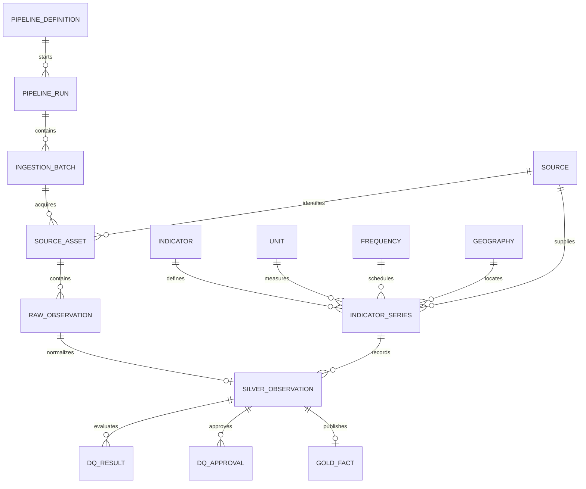

# LAZA SQL Server data model - approval draft

> Status: **DRAFT FOR APPROVAL**. No script in this package has been executed.

## Objective

Provide a small, governed SQL Server implementation of the LAZA medallion
architecture for the six pilot indicators. The model is deliberately portable:
raw ingestion, canonical observations, data-quality evidence and presentation
tables remain separated so that a later move to GCP does not require redesigning
the business contract.

## Target instance and constraints

| Decision | Proposed value |
| --- | --- |
| Instance | `.\SQLEXPRESS` |
| Database | `LAZA_DATA_PLATFORM_DEV` |
| Recovery model | `SIMPLE` for the local POC |
| Authentication | Windows authentication |
| Collation | Instance default: `Latin1_General_CI_AS` |
| Orchestration | Windows Task Scheduler, Python, PowerShell or Alteryx |
| Raw files | Outside SQL Server; database stores path, hash and metadata |
| SQL Express limit | Keep the database below 10 GB and monitor growth |

## Logical flow

```text
Official source or controlled demo fixture
                    |
                    v
        control.ingestion_batch
                    |
                    v
 bronze.source_asset + bronze.raw_indicator_observation
                    |
        validation / normalization
                    v
 reference.* + silver.indicator + silver.indicator_series
                    |
                    v
              silver.observation
                    |
              DQ execution
                    v
       dq.result + dq.approval + dq.indicator_score
                    |
          publication gate
                    v
 gold.dim_* + gold.fact_indicator_observation
                    |
                    v
          api.vw_indicator_latest
```

## Schemas and ownership

| Schema | Purpose | Write owner |
| --- | --- | --- |
| `control` | Pipeline definitions, runs and ingestion batches | Orchestrator |
| `audit` | Append-only operational events and rejected records | Orchestrator |
| `reference` | Controlled source, unit, frequency and geography values | Data steward |
| `bronze` | Immutable source assets and raw records | Ingestion pipeline |
| `silver` | Canonical indicators, series and versioned observations | Transformation pipeline |
| `dq` | Rules, executions, results, exceptions, approvals and scores | DQ pipeline / approver |
| `gold` | Curated dimensions and facts for consumption | Publication pipeline |
| `api` | Read-only views exposed to the future API | No direct writes |

## Core entity model



## Table inventory

| Layer | Tables or views |
| --- | --- |
| Control | `pipeline_definition`, `pipeline_run`, `ingestion_batch` |
| Audit | `pipeline_event`, `rejected_record` |
| Reference | `source`, `unit`, `frequency`, `geography` |
| Bronze | `source_asset`, `raw_indicator_observation` |
| Silver | `indicator`, `indicator_series`, `observation` |
| DQ | `rule`, `rule_version`, `execution`, `result`, `exception`, `approval`, `indicator_score` |
| Gold | `dim_indicator`, `dim_source`, `dim_unit`, `dim_geography`, `dim_series`, `dim_date`, `fact_indicator_observation` |
| API | `vw_indicator_latest` |

## Grain and keys

### Bronze

- `bronze.source_asset`: one row per acquired file, endpoint response or
  controlled fixture version.
- `bronze.raw_indicator_observation`: one row per source record within an
  ingestion batch.
- `record_hash` makes reprocessing idempotent inside a batch.
- `raw_payload` preserves the original JSON representation.

### Silver

- `silver.indicator`: one governed business indicator.
- `silver.indicator_series`: one indicator + source + geography + unit +
  frequency + methodology combination.
- `silver.observation`: one version of one series for one reference period.
- The business grain is series, reference-period start, reference-period end
  and current version.
- `observation_hash` prevents duplicate versions of the same observation.

### Gold

- Dimensions contain consumer-friendly attributes copied at publication time.
- `gold.fact_indicator_observation`: one published or explicitly demonstrative
  observation per series and reference period.
- `api.vw_indicator_latest`: latest Gold observation for each indicator.

## Publication states

| State | Meaning | Allowed in Gold? | Allowed as official? |
| --- | --- | ---: | ---: |
| `DEMONSTRATION` | Value inherited from the visual prototype | Yes, visibly labelled | No |
| `VALIDATED` | Source and transformation reviewed | No | No |
| `APPROVED` | DQ evidence and accountable approval recorded | Yes | Not until publication |
| `PUBLISHED` | Approved value released for consumption | Yes | Yes |
| `REJECTED` | Failed validation or approval | No | No |

The demo seed deliberately loads Gold records with
`publication_status = 'DEMONSTRATION'` and `is_official = 0`. A source homepage
is not considered evidence of an official observation.

## Pilot mapping

| Indicator code | Initial source | Reference period | Classification |
| --- | --- | --- | --- |
| `gdp-growth` | INE quarterly national accounts | 2021-Q1 to 2026-Q1 | OFFICIAL / PUBLISHED |
| `inflation-rate` | INE national IPCN | 2021-01 to 2026-06 | OFFICIAL / PUBLISHED |
| `exchange-rate` | BNA reference-rate API | 2021-01 to 2026-06 | OFFICIAL / PUBLISHED |
| `population` | INE RGPH census results | Census 2014 and Census 2024 | OFFICIAL / PUBLISHED |
| `banking-assets` | BNA monetary and financial statistics | 2021-01 to 2026-05 | OFFICIAL / PUBLISHED; 2026 preliminary |
| `public-debt-gdp` | UGD public-debt statistical bulletins | 2025 and 2026-Q1 | OFFICIAL / PUBLISHED; Q1 2026 derived from official components |

## Security model

The package creates database roles but no server login or database user:

| Role | Intended access |
| --- | --- |
| `laza_pipeline_executor` | Execute future pipeline procedures and write operational layers |
| `laza_data_reader` | Read Silver, DQ and Gold data |
| `laza_data_approver` | Record DQ approvals and exceptions |
| `laza_api_reader` | Read only the `api` schema |

User-to-role assignments remain a separate approval decision.

## Initial DQ controls

1. Required indicator code, numeric value, unit and reference period.
2. JSON payload validity in Bronze.
3. Duplicate hash rejection within a batch.
4. Unique current Silver observation at the declared business grain.
5. Allowed direction, state and classification values.
6. Exact source asset, checksum and acquisition timestamp required before an
   observation can become official.
7. DQ approval required before `PUBLISHED` Gold status.

The Gold publication trigger enforces the gate even for direct table writes.
Official Gold rows require the latest approval to be `APPROVE/OFFICIAL`, the
Silver observation to be `PASSED/PUBLISHED`, and the Bronze source asset to be
official with its required evidence. Demo rows require the latest approval to
be `APPROVE/DEMO` and remain non-official.

The initial demo score uses a transparent POC formula: `PASS = 1`, `WARN =
0.5`, `FAIL = 0`. Two passes and one warning produce `83.33`. This scoring
policy must be reviewed before any official publication.

## Approval decisions

Before execution, approve or amend:

1. Database name `LAZA_DATA_PLATFORM_DEV`.
2. Use of `SIMPLE` recovery for the POC.
3. Default SQL data directory for MDF/LDF files.
4. External landing-folder location for raw source assets.
5. Schema and table naming convention.
6. Database role names and eventual member accounts.
7. Permission to load the six demo values into Gold as non-official data.
8. Orchestrator choice for scheduled execution.
